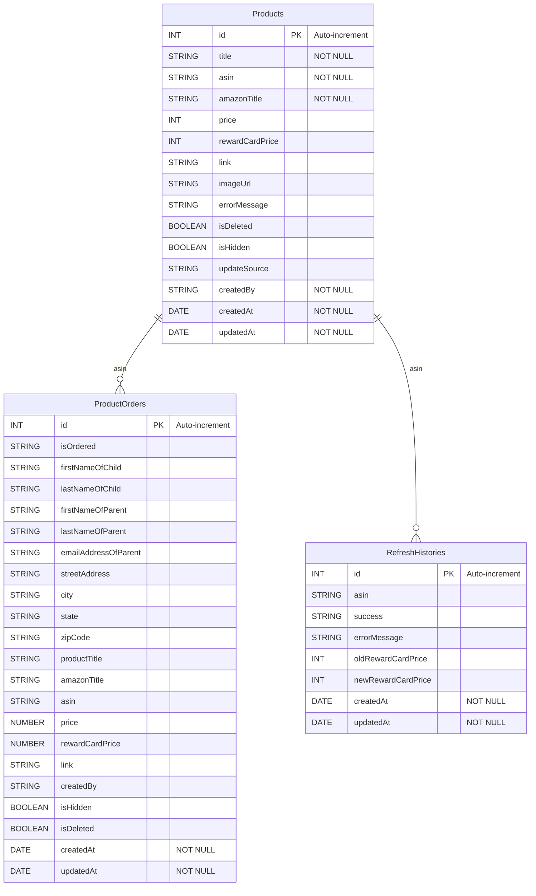

# Database ERD Schema

## Entity Relationship Diagram

## Table Descriptions

### Products
The main product catalog. Each row represents an Amazon product tracked by the reward cabinet. Products are looked up via the Rainforest API using their ASIN and their prices are converted into reward card points using a configurable multiplier. Soft-deletion is supported via the `isDeleted` flag, and products can be hidden from the storefront with `isHidden`.

| Column | Type | Constraints | Description |
|---|---|---|---|
| `id` | INT | PK, Auto-increment | Unique product identifier |
| `title` | STRING | NOT NULL | Display title (can differ from Amazon title) |
| `asin` | STRING | NOT NULL | Amazon Standard Identification Number |
| `amazonTitle` | STRING | NOT NULL | Original product title from Amazon |
| `price` | INT | | Product price in cents (ceiling of Amazon price) |
| `rewardCardPrice` | INT | | Price in reward card points (`ceil(price × 1.50)`) |
| `link` | STRING | | Amazon affiliate link |
| `imageUrl` | STRING | | Product image URL |
| `errorMessage` | STRING | | Error details from last refresh attempt |
| `isDeleted` | BOOLEAN | | Soft-delete flag |
| `isHidden` | BOOLEAN | | Hide from storefront |
| `updateSource` | STRING | | How the product was last updated (e.g. `manual`, `refresh`) |
| `createdBy` | STRING | NOT NULL | User who created the record |
| `createdAt` | DATE | NOT NULL | Record creation timestamp |
| `updatedAt` | DATE | NOT NULL | Record last-updated timestamp |

### ProductOrders
Stores customer orders. Each order captures the child/parent information, shipping address, and a snapshot of the product at the time of order. Linked to Products by `asin`.

| Column | Type | Constraints | Description |
|---|---|---|---|
| `id` | INT | PK, Auto-increment | Unique order identifier |
| `isOrdered` | STRING | | Whether the product has been ordered from Amazon |
| `firstNameOfChild` | STRING | | Child's first name |
| `lastNameOfChild` | STRING | | Child's last name |
| `firstNameOfParent` | STRING | | Parent's first name |
| `lastNameOfParent` | STRING | | Parent's last name |
| `emailAddressOfParent` | STRING | | Parent's email address |
| `streetAddress` | STRING | | Shipping street address |
| `city` | STRING | | Shipping city |
| `state` | STRING | | Shipping state |
| `zipCode` | STRING | | Shipping zip code |
| `productTitle` | STRING | | Product display title at time of order |
| `amazonTitle` | STRING | | Amazon product title at time of order |
| `asin` | STRING | | Amazon ASIN of ordered product |
| `price` | NUMBER | | Product price at time of order |
| `rewardCardPrice` | NUMBER | | Reward card price at time of order |
| `link` | STRING | | Amazon product link |
| `createdBy` | STRING | | User who placed the order |
| `isHidden` | BOOLEAN | | Hide from admin view |
| `isDeleted` | BOOLEAN | | Soft-delete flag |
| `createdAt` | DATE | NOT NULL | Order creation timestamp |
| `updatedAt` | DATE | NOT NULL | Order last-updated timestamp |

### RefreshHistories
Audit log tracking every product price refresh from Amazon. Each record captures the ASIN refreshed, whether it succeeded, and the before/after reward card prices.

| Column | Type | Constraints | Description |
|---|---|---|---|
| `id` | INT | PK, Auto-increment | Unique history record identifier |
| `asin` | STRING | | ASIN of the product that was refreshed |
| `success` | STRING | | Whether the refresh succeeded |
| `errorMessage` | STRING | | Error details if the refresh failed |
| `oldRewardCardPrice` | INT | | Reward card price before refresh |
| `newRewardCardPrice` | INT | | Reward card price after refresh |
| `createdAt` | DATE | NOT NULL | Refresh timestamp |
| `updatedAt` | DATE | NOT NULL | Record last-updated timestamp |

## Relationships

- **Products → ProductOrders**: One product (by `asin`) can have many orders. The `asin` column in `ProductOrders` references the product that was ordered.
- **Products → RefreshHistories**: One product (by `asin`) can have many refresh history records. Each refresh log entry records the `asin` of the product that was refreshed.

> **Note:** These relationships are logical (matched by `asin`). The current schema does not enforce foreign key constraints at the database level.
